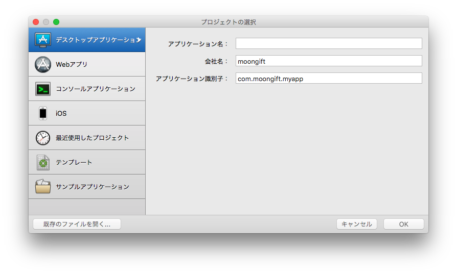
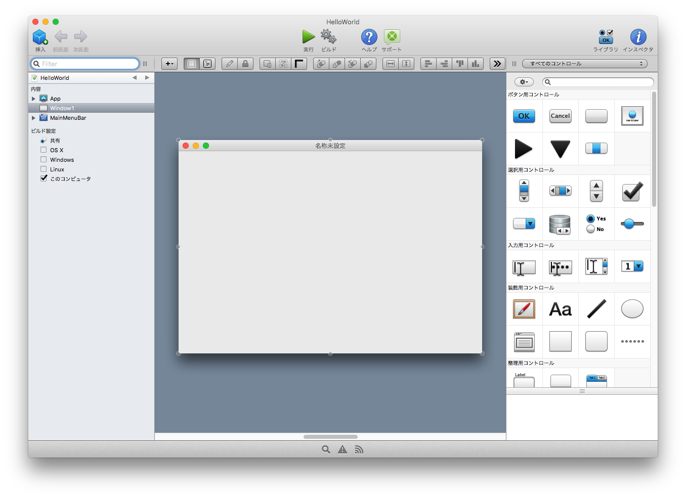

# 1. プロジェクトを作る

Xojoを立ち上げる、または新規プロジェクト（Ctrl+Nまたはコマンド+N）を選択すると次のような画面が表示されます。

Xojoでは幾つかのアプリケーションが開発できます。

1. デスクトップアプリケーション
1. Webアプリ
1. コンソールアプリケーション
1. iOS（macOSのみ）

今回はデスクトップアプリケーションを選択します。

アプリケーション名は英語の方が無難ですが、Xojoは内部的にUTF-8になっていますので問題はないはずです。会社名はなくても構いません。最後のアプリケーション識別子というのはXojoアプリの内部的な名称になります。

アプリケーション識別子は自由に入力できます。多くの場合、会社のドメインの逆順（www.example.comの場合、com.exapmle.www）にするのが通例となっています。

必要な情報を入力した後、OKボタンを押すと下のような画面が表示されれば完了です。

では[画面を作る](2.md)に進んでください。
