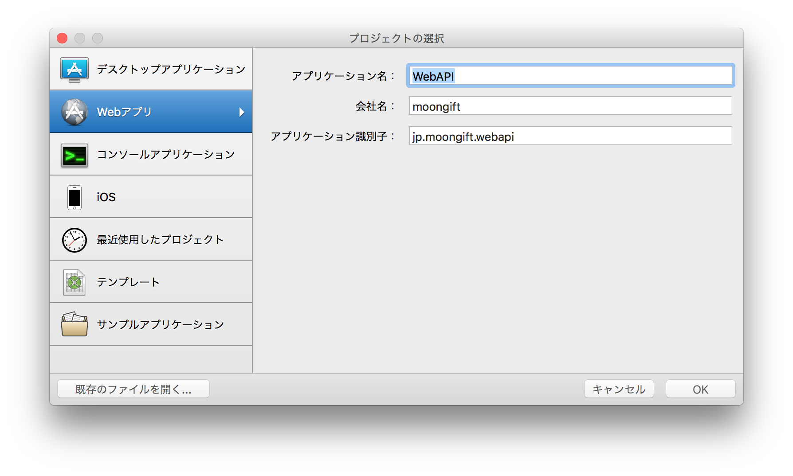
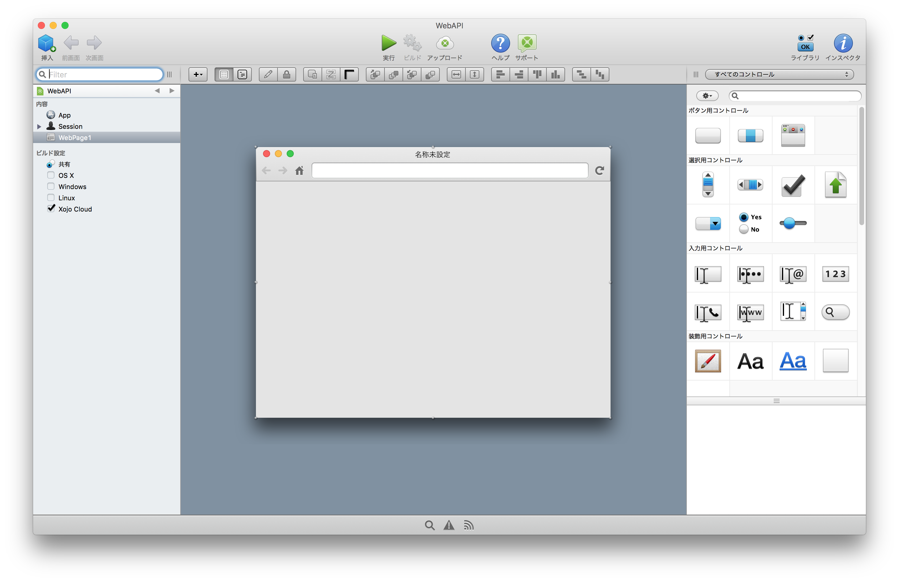
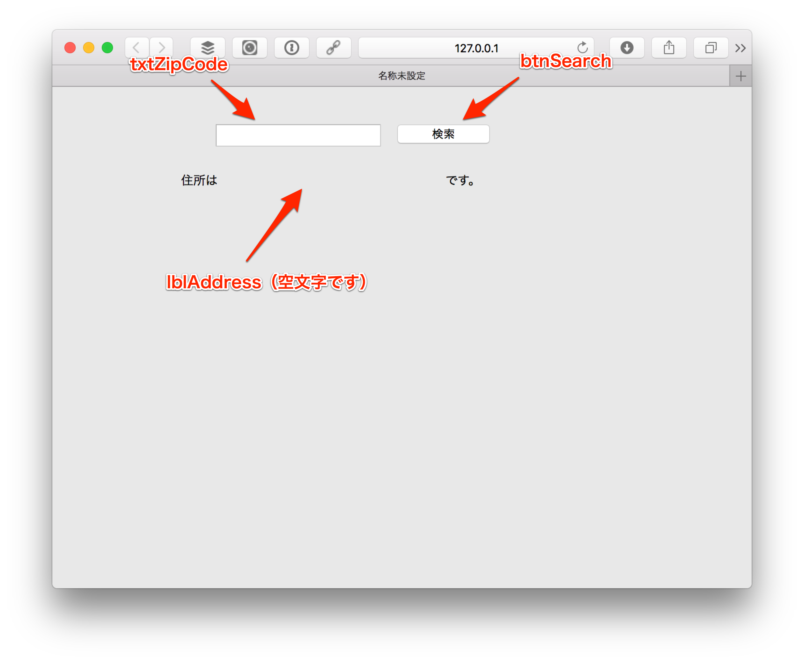

# Web APIを試す

こちらの資料ではXojoを使ってWeb APIを呼び出すソフトウェアを作ってみたいと思います。今回はデスクトップではなく、Webアプリケーションとして開発します。

ファイルメニューの新しいプロジェクトを選択し、Webアプリケーションを選択してください。アプリケーション名は任意ですが、ZipSearchなどが良いと思います。

今回作るのは郵便番号で検索すると、その住所を表示するというものです。郵便番号の検索は[郵便番号検索API - zipcloud](http://zipcloud.ibsnet.co.jp/doc/api)を利用します。このサービスでは、

```
http://zipcloud.ibsnet.co.jp/api/search?zipcode=7830060
```

のようなアクセスすると、住所がJSONで返ってきます。

```
{
	"message": null,
	"results": [
		{
			"address1": "高知県",
			"address2": "南国市",
			"address3": "蛍が丘",
			"kana1": "ｺｳﾁｹﾝ",
			"kana2": "ﾅﾝｺｸｼ",
			"kana3": "ﾎﾀﾙｶﾞｵｶ",
			"prefcode": "39",
			"zipcode": "7830060"
		}
	],
	"status": 200
}
```

この仕組みを使ってアプリを作っていきます。

----

前回と同様にXojoを立ち上げた後、新規プロジェクトを開始します。Webアプリを選択し、適当なアプリケーション名を入力します（例えばWebAPIなど）。



OKを押すと、下のような画面が表示されます。



ここに、次のコントロールを配置します。

- Button
- Text Field
- Labelを3つ


それぞれ名前（Name）をインスペクタを使って変更します。

- Buttonの名前：btnSearch
- Text Fieldの名前：txtZipCode
- Labelの一つの名前：lblAddress

さらに btnSearch の Caption を検索とします。画面としては以下のようになります。lblAddressは空文字にしているので注意してください。



----

では[次回](./11.md)は処理を作っていきます。
