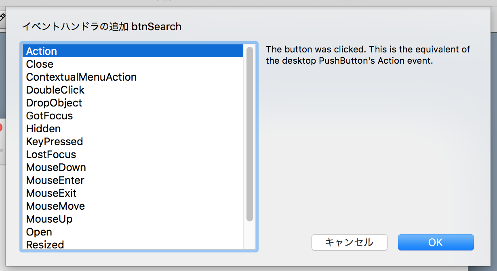
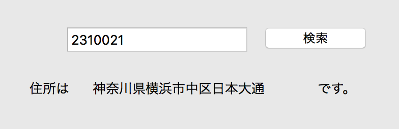

# ネットワークデータの取得処理を作る

では今回は検索処理を作っていきます。

まずボタンを押した時のアクションを作っていきます。btnSearchをダブルクリックして、Actionを選択してOKボタンを押してください。



そして処理を書いていきます。

## 変数の定義

まず必要な変数を定義します。

```
// 変数の定義
// アクセスするURLの基本部分です
Dim url As String = "http://zipcloud.ibsnet.co.jp/api/search?zipcode="

// HTTPアクセスするモジュール
Dim http As New HTTPSocket

// 入力された郵便番号
Dim zipCode as string = txtZipCode.Text
```

## Web APIを呼び出す

先ほど定義したhttpを使ってWeb APIにアクセスします。この時、ネットワークを使ったアクセスではどのようなエラーが起きるか分からないため、Try/Catchを使ってエラーが起きてもソフトウェアが落ちないように予防します。以下のように書くことで、Try〜Catchの間でエラーが起こった場合、Catch以下にジャンプするようになります。


```
Try
  // この中に処理を書きます。
Catch t as UnsupportedOperationException
  // エラーが発生した場合はこちら
  MsgBox("ネットワーク上のエラーが発生しました")
End Try
```

ではTry〜Catchの間に書く処理について紹介します。

```
// http.Getを使ってデータを取得します

// 文字コードを指定します

// JSONをパースします

// 住所が取れない場合はエラーです

// 住所を取り出します

// 住所を表示します
```

### http.Getを使ってデータを取得します

ネットワークアクセスを http を使って行います。15というのはタイムアウトする秒数で、15秒間接続できないとエラー（Catchへ移動）になります。

```
// http.Getを使ってデータを取得します
Dim result as String = http.Get(url + zipCode, 15)
```

### 文字コードを指定します

取得したデータは文字化けした状態で送られてきます（文字コードが指定されていないため）。そこで文字コード変換を行います。今回はUTF8に変換しています。

```
// 文字コードを指定します
result = DefineEncoding(result, Encodings.utf8)
```

### JSONをパースします

そして変換された文字列をJSONオブジェクトに変換します。

```
// JSONをパースします
Dim json As  new JSONItem(result.ToText)
```

### 住所が取れない場合はエラーです

住所が取れない場合というのは不正な郵便番号が入力された場合などです。この場合はJSONのresults以下が空になります。

```
// 住所が取れない場合はエラーです
if json.Value("results") = nil then
  MsgBox("住所が存在しません")
  exit
end if
```

### 住所を取り出します

住所がある、JSONのresultsまでJSONオブジェクトを掘り下げていきます。本来、ここまでやらなくとも大丈夫ですが、今回は分かりやすさのために行っています。resultsの中身は配列になっていますので、その最初のデータ（0で指定）を取り出しています。

```
Dim resultsJson as JSONItem = json.Value("results")
Dim addressJSON as JSONItem = resultsJson.Value(0)
```

### 住所を表示します

最後に住所をラベルに表示します。address1〜3を連結して、それをラベルに表示します。

```
// 住所を表示します
Dim address  as string = addressJSON.Value("address1") + addressJSON.Value("address2") + addressJSON.Value("address3")
lblAddress.Text = address
```

----

全体の処理は次のようになります。

```
// 変数の定義
// アクセスするURLの基本部分です
Dim url As String = "http://zipcloud.ibsnet.co.jp/api/search?zipcode="
// HTTPアクセスするモジュール
Dim http As New HTTPSocket
// 入力された郵便番号
Dim zipCode as string = txtZipCode.Text

Try
  // http.Getを使ってデータを取得します
  Dim result as String = http.Get(url + zipCode, 15)
  // 文字コードを指定します
  result = DefineEncoding(result, Encodings.utf8)
  // JSONをパースします
  Dim json As  new JSONItem(result.ToText)
  
  // 住所が取れない場合はエラーです
  if json.Value("results") = nil then
    MsgBox("住所が存在しません")
    exit
  end if
  
  // 住所を取り出します
  Dim resultsJson as JSONItem = json.Value("results")
  Dim addressJSON as JSONItem = resultsJson.Value(0)
  
  // 住所を表示します
  Dim address  as string = addressJSON.Value("address1") + addressJSON.Value("address2") + addressJSON.Value("address3")
  lblAddress.Text = address
  
Catch t as UnsupportedOperationException
  // エラーが発生した場合はこちら
  MsgBox("ネットワーク上のエラーが発生しました")
End Try
```

----

ここまで終わったらXojo IDEの実行ボタンを押してみましょう。Webブラウザが立ち上がって、入力画面が表示されればOKです。


そして郵便番号を入力して検索ボタンをクリックすると、住所が表示されるはずです。



では最後に[地図表示を行ってみたい](./12.md)と思います。
