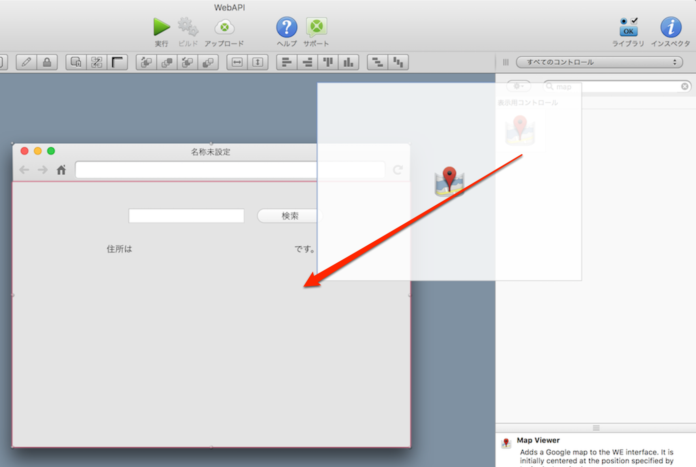
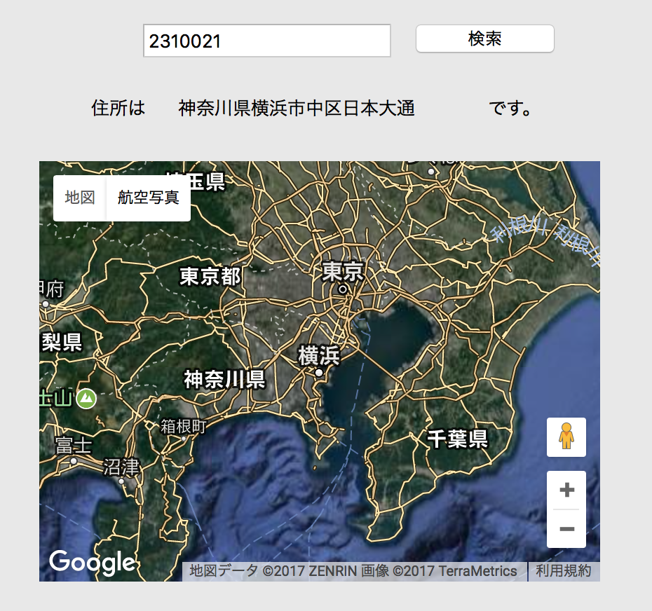
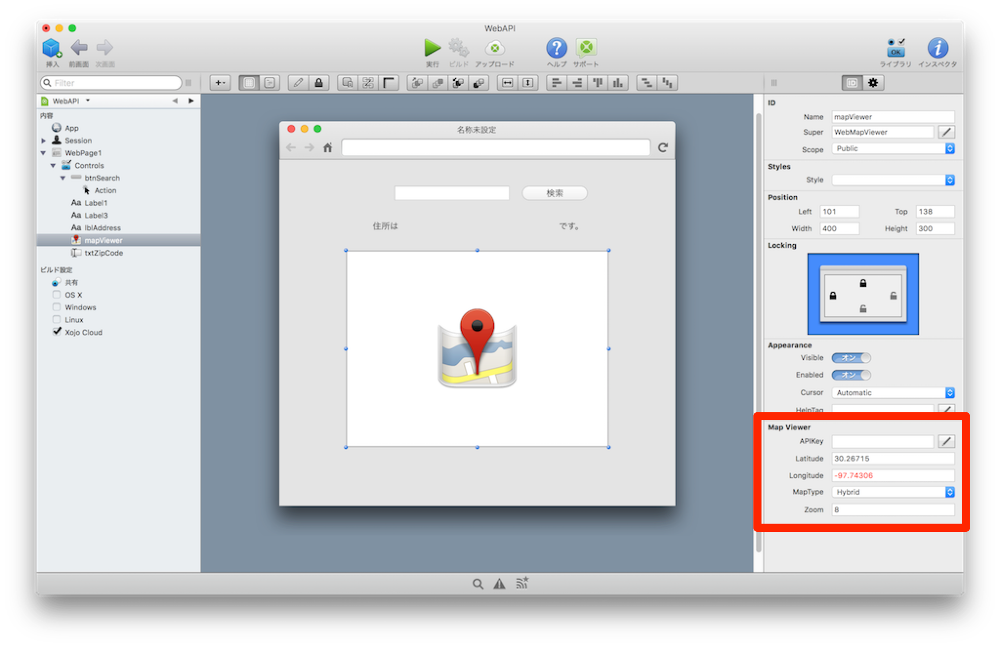

# 地図を表示する

前回までで郵便番号から住所を表示することができましたが、見た目のインパクトは強くないと思います。そこで、Xojoの標準コントロールを使って地図表示を行ってみましょう。

ライブラリにMap Viewerがあるので、それを追加します。



追加したらインスペクタで名前（Name）をmapViewerに変更しておきます。そして前回書いた検索処理に追加します。

```
// 住所を表示します
Dim address  as string = addressJSON.Value("address1") + addressJSON.Value("address2") + addressJSON.Value("address3")
lblAddress.Text = address

// ここに追加します
```

追加する内容は次のようになります。 address は住所の文字列です（神奈川県横浜市中区日本大通7など）。その文字列をWebMapLocationに渡すと位置情報に変換してくれます。そして、それを mapViewer.GoToLocation に渡すと地図の中心点を変更してくれます。

```
// 地図に表示する
Dim location As New WebMapLocation(address)
mapViewer.GoToLocation(location)
```

実行して検索を行うと、次のような結果になります。もし地図が表示されない場合は[Googleマップのキーを取得](https://developers.google.com/maps/web/)してください。APIキーはmapViewerのインスペクタ内に設定箇所があります。



これでも良いですが、若干分かりづらいのでインスペクタをチェックしましょう。mapViewerのインスペクタの中のMapTypeをRoadmap、Zoomを15にします。



そうすると検索結果が分かりやすくなるはずです。


----

今回のハンズオンは以上になります。Xojoを使えばデータベースやWeb APIを使ったアプリケーションがとても簡単に作成できます。ぜひ使ってみてください。
