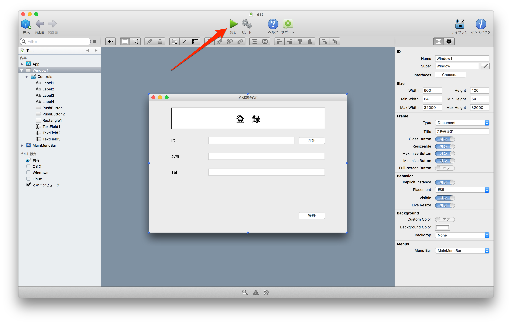
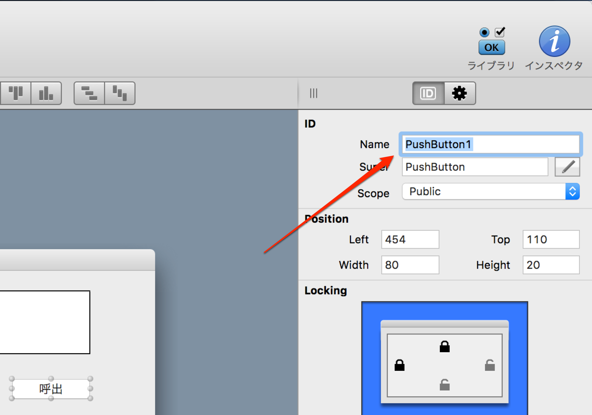
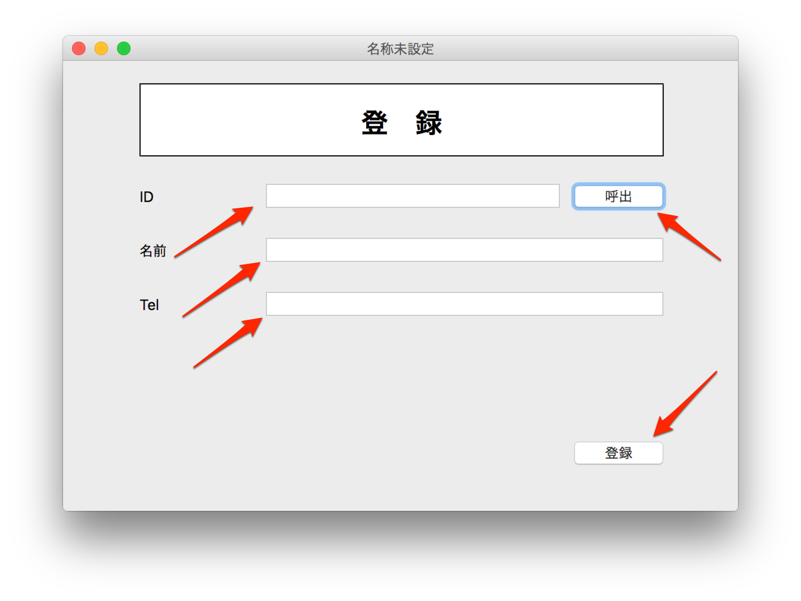
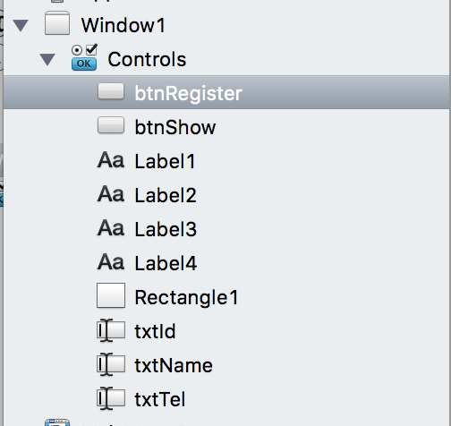

# 実行してみる&開発の準備

今回はまずプロジェクトを実行してアプリとしての動作を確認してみましょう。

## 実行

実行は画面上にある実行ボタンをクリックします。

そうすると次のようにアプリケーションが立ち上がります。

今の時点では特に何もできませんが、これから実装を行っていきます。今回はまずその準備を行っていきます。

## コントローラに名前をつける

各コントローラにはデフォルトでTextField1やPushButton1といった名前がつきます。これではプログラミングを組んでいく内に分かりづらくなっていくので、固有の名称をつけていきましょう。

名称の変更は各コントローラのインスペクタの中で、Nameを変更して行います。

例えば今回は次のようにします。Idは（アイディー）なのでl（エルの小文字）と間違わないようにしてください。

|コントローラ|名前|
|------------------|------------------|
|IDのText Field|txtId|
|名前のText Field|txtName|
|TelのText Field|txtTel|
|呼出ボタン|btnShow|
|登録ボタン|btnRegister|

変更が終わると、左側のコントロール一覧にある名前も変わっているのが確認できるはずです。

ラベルや四角はアクションを設定しないので今回はデフォルトのままですが、名前を変更した方が識別しやすくなるでしょう。

----

今回で開発する準備が完了しました。次回から実際に開発を進めていきます。[イベントを実装する](4.md)に進んでください。
