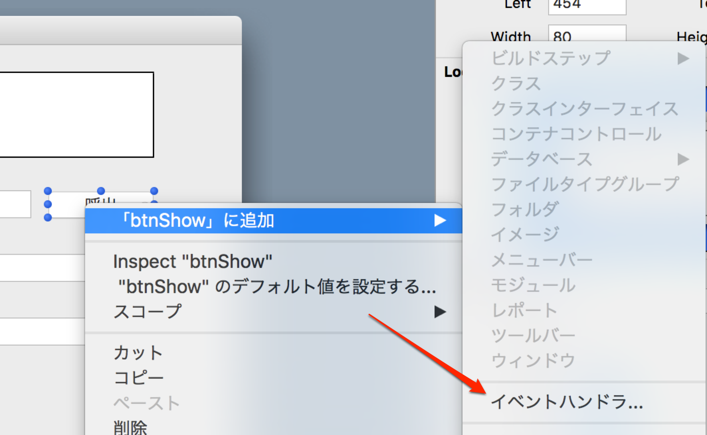
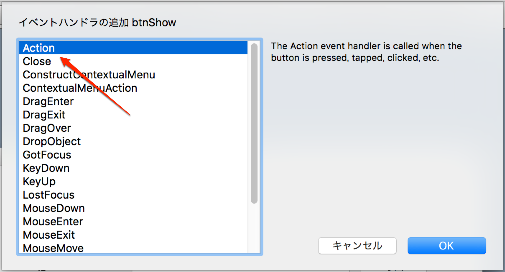
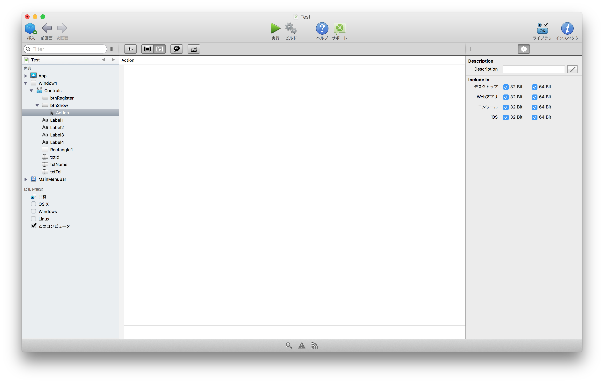
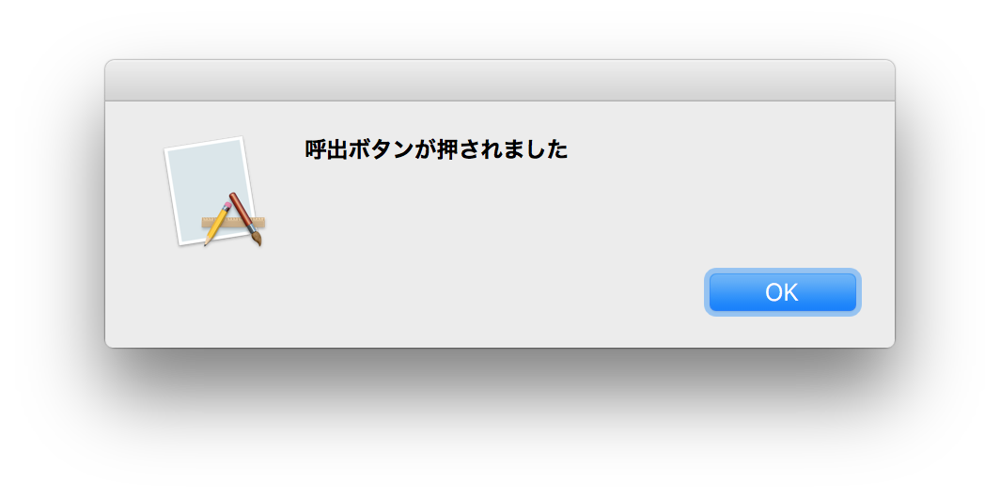
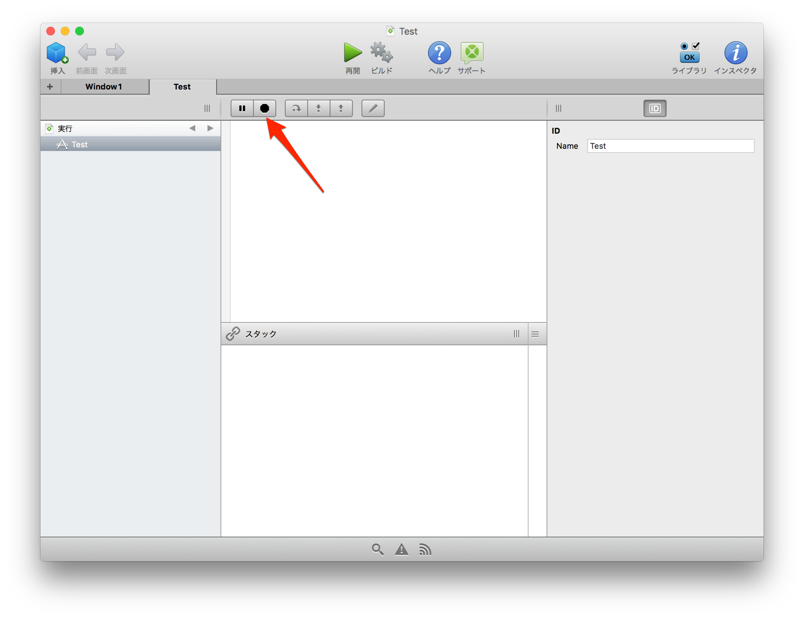

# イベントを実装する

今回はアプリケーションにイベントを記述していきます。

Xojoではボタンを押した、マウスをクリックした、テキストフィールドにフォーカスが当たったなどといったアクションをトリガーとしてイベントを実装していきます。これはVBやVBAに近いものになるでしょう。

## ボタンにイベントを設定する

ではまず呼出ボタンにイベントを設定してみましょう。呼出ボタンを右クリックして、 **「btnShow」に追加 > イベントハンドラ** を選択します。



そうすると各種イベントハンドラが表示されます。今回は最初から選択されている Action を追加するので、そのままOKを押してください。



そうすると下の画像のようにコードを書く画面に切り替わります。



この画面はいわば、次のように書かれている状態です。そのため、 `Sub Action()` といった記述はいらず、いきなり内部のコーディングがはじめられます。

```
#tag Events btnShow
	#tag Event
		Sub Action()
		  
		End Sub
	#tag EndEvent
#tag EndEvents
```

では次のようにコードを書いてみましょう。

```
MsgBox "呼出ボタンが押されました"  
```

これで保存して、アプリケーションを実行します。呼出ボタンを押して、次のダイアログが出てくればOKです。



## アプリケーションを終了する

アプリケーションを終了する場合はアプリケーション側では Alt+F4またはコマンド+Qで終了する他、Xojoでは停止ボタンを押して終了できます。



----

Xojoではこのような方法でイベントに合わせたコーディングを行っていきます。一部は表示されないコードもあるので慣れが必要ですが、より簡単にコーディングできるようになっているとも言えるでしょう。

では次回はコーディングに伴うデバッグ方法について紹介します。[デバッグする](5.md)に進んでください。

