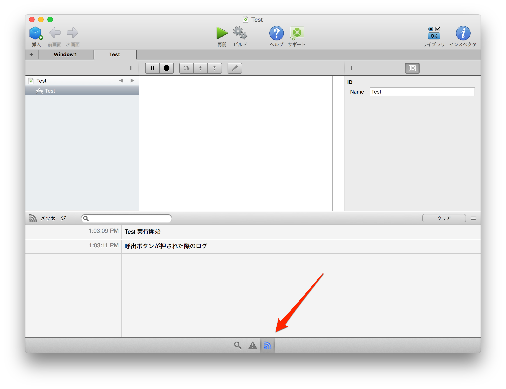
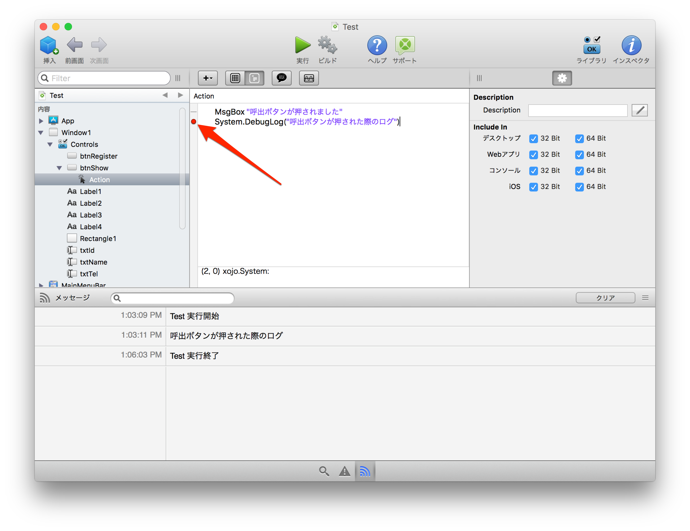
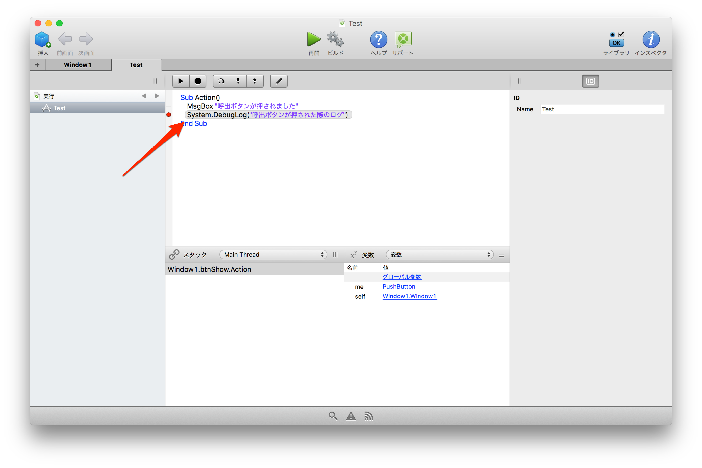
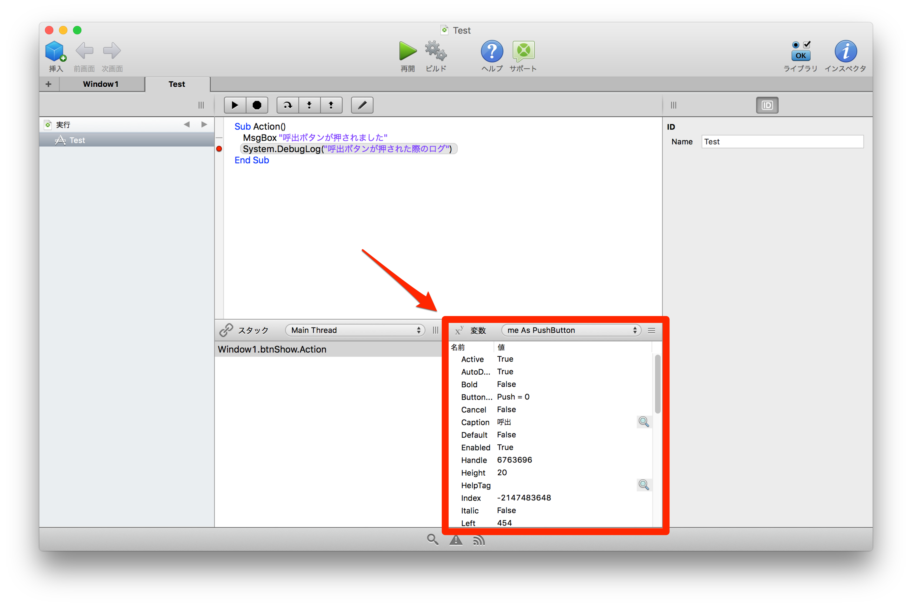

# デバッグする

アプリケーション開発において絶対に必要なのがデバッグです。今回はXojoでのデバッグ方法を紹介します。

## ログメッセージ

まず一つ目はログメッセージの出し方です。Xojoでは`System.DebugLog` というメソッドを使います。

前回の呼出ボタンを押した処理を次のようにしましょう。

**元：**

```
MsgBox "呼出ボタンが押されました"
```

**修正後：**

```
MsgBox "呼出ボタンが押されました"
System.DebugLog("呼出ボタンが押された際のログ")
```

これで実行してみます。呼出ボタンを押すとまずダイアログが出るはずです。

そして、Xojo IDEの画面下にあるログアイコンをクリックすると、ログメッセージが確認できます。



このようにしてXojoではログメッセージを確認します。なお、 `System.DebugLog` は String 型のみ受け付けるので、数値などの場合はStr関数を使った変換が求められます。

## ブレークポイント

次に処理を一時的に停止するブレークポイントです。同じく呼出ボタンのアクション内のコードで、適当な行の左側をクリックします。そうすると赤いアイコンが表示されるでしょう。ここで処理が一時的に止まります。



では実際に実行して、呼出ボタンをクリックします。そうするとブレークポイントがあるところで処理が停止するはずです。




右下の部分では実行時に存在する変数の内容を閲覧できます。階層になっている場合はリンクをクリックしてドリルダウンできます。よくあるマウスオーバーで変数の内容が出るという形ではないので注意してください。



----

Xojoではこのデバッグメッセージとブレークポイントを使ってアプリケーションの開発、デバッグを補助します。ぜひ活用してください。

続いてBasicとXojoを分ける、クラスの書き方を紹介します。今回はデータを扱う処理をモデル（クラス）として定義します。[クラスの作成](6.md)へ進んでください。


