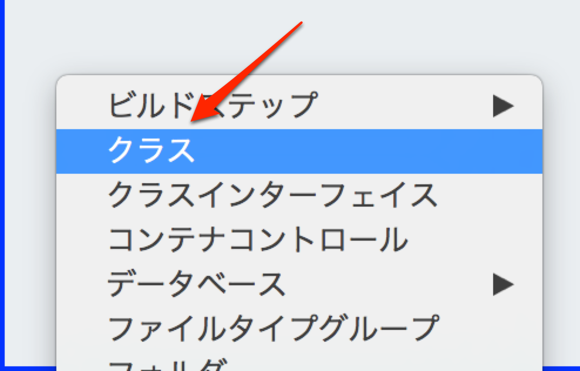
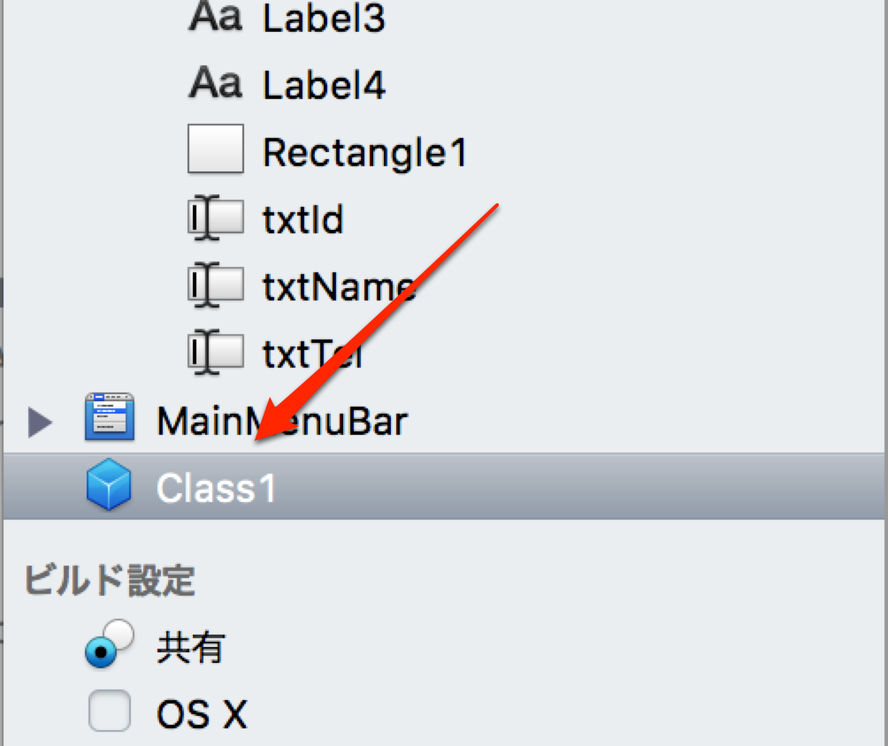
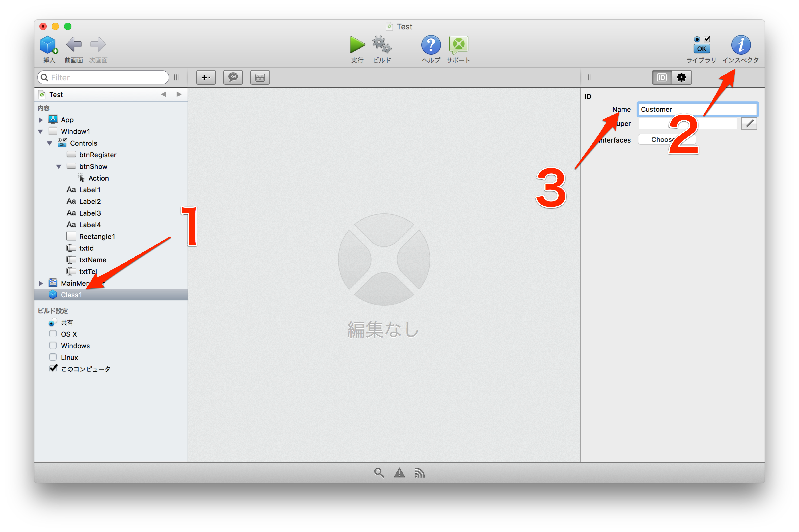
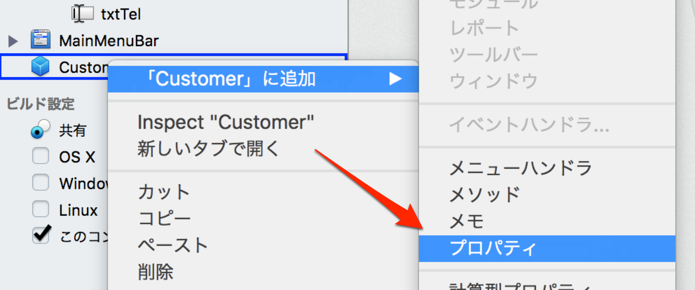
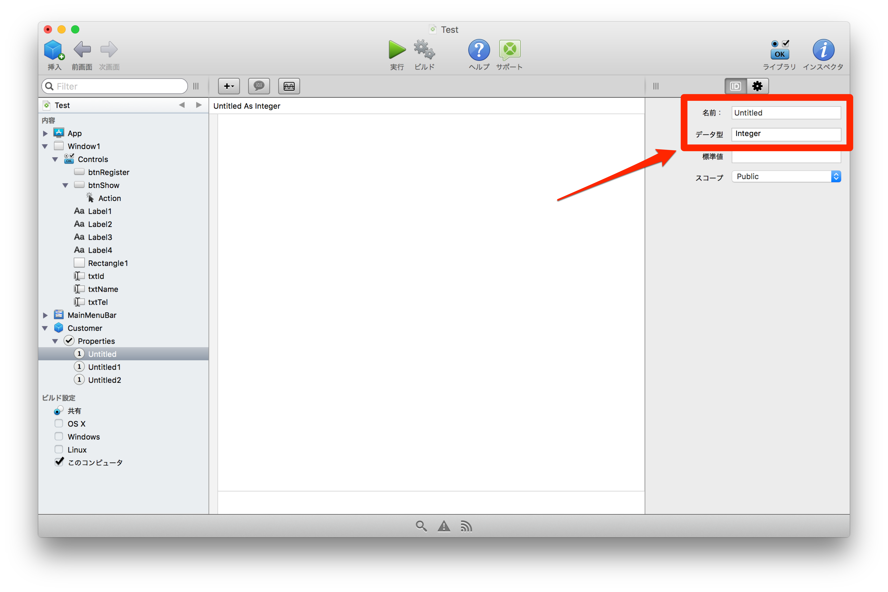
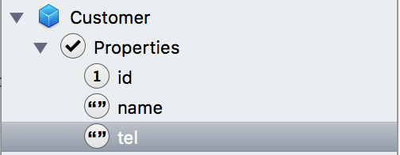
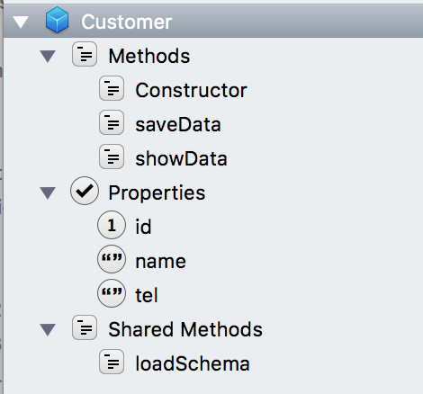

# クラスの作成

XojoはBasicにオブジェクト指向を取り入れたプログラミング言語となっています。といってもプログラミングだけで定義するのではなく、コントロールと同様にビジュアル的に定義できるのが魅力です。

## クラスを作成する

まず左側のコントロール一覧の任意の場所で右クリックし、クラスを選択します。



そうするとClass 1というオブジェクトが作られます。



これでクラスの作成は完了です。

## 名前を変更する

次にクラスの名前を変更します。これはコントロールの時と同じで、Class 1を選択して（下の画像の1）右側のインスペクタボタンをクリック（下の画像の2）すると Name が Class 1となっている（下の画像の3）ところが見つかるはずです。これを Customer としましょう。



## プロパティを追加する

このクラスは画面上の入力欄と一致するものになります。そこでプロパティをそれぞれ定義します。プロパティとはクラスのインスタンス（オブジェクト）がそれぞれ保持する変数です。

名称とデータ型はそれぞれ次の通りです。

- id  
Integer（整数）
- name  
String（文字列）
- tel  
String（文字列）

Customerクラスを右クリックして、 **「Customer」に追加 > プロパティ** を選択します。



一つプロパティが追加されたら、同じようにメニューから選択することも、プロパティをコピー（Ctrl+Cまたはコマンド+C）&ペースト（Ctrl+Vまたはコマンド+V）で追加することもできます。全部で3つのプロパティを用意してください。


そして、インスペクタを使ってプロパティの名前とデータ型、標準値（デフォルト値）を次の通りに設定してください。すべてスコープはPublicとします。



設定完了時は次のように並んでいるでしょう。

|名前|データ型|標準値|
|:-----|:-----|:-----|
|id|Integer|0|
|name|String|&nbsp;|
|tel|String|&nbsp;|



## メソッドを追加する

続いてメソッドを追加します。メソッドはクラスが持っている関数です。今回はデータの読み込みと保存をサポートすることにします。

プロパティと同様、クラスを右クリックして **「Customerに追加」> メソッド** を選択します。メソッドは3つ追加してください。


追加した3つのメソッドですが、それぞれ次のように名前を変えてください。あえて画面は出しませんが、インスペクタで変更します。スコープはすべてPublicです。

|メソッド名|引数|戻り値型|
|:--------------|:--------------|:--------------|
|Constructor|id as Integer|なし|
|showData|&nbsp;|Boolean|
|saveData|&nbsp;|Boolean|

**※ Boolean 型は True/False のいずれかを返します。**

### Constructor とは？

Constructor とはクラスのインスタンスを作成する際に呼び出されるメソッドになります。次のようなコードです。

```
c = new Constructor // ここで呼ばれる
```

今回は引数を追加していますので、次のようなコードになります。

```
id = 1
c = new Constructor(id) // ここで呼ばれる
```

## 共有メソッドの追加

続いて共有メソッドを追加します。これはJavaでいうところのstaticメソッド、Rubyでいうところのクラスメソッド相当のものと考えてください。クラスをインスタンス化せずに使えるメソッドです。

クラスを右クリックして **「Customerに追加」> 共有メソッド** を選択します。メソッドは1つ追加してください。内容は次の通りです。

|メソッド名|引数|戻り値型|
|:--------------|:--------------|:--------------|
|loadSchema|&nbsp;|Boolean|

## クラスの完成

最終的にクラスは次のようになっているはずです。



後は各メソッドを実行していくだけです。

----

次回はこのクラスを活用するためにデータベースの接続を行っていきます。[データベースに接続する](7.md) に進んでください。


