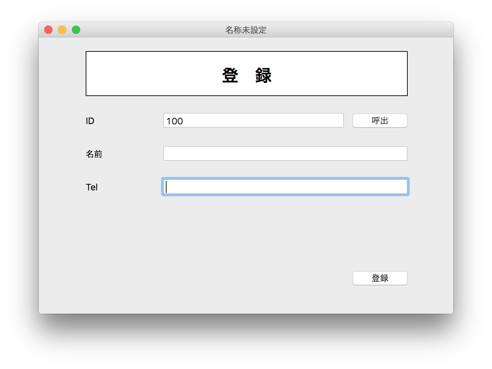
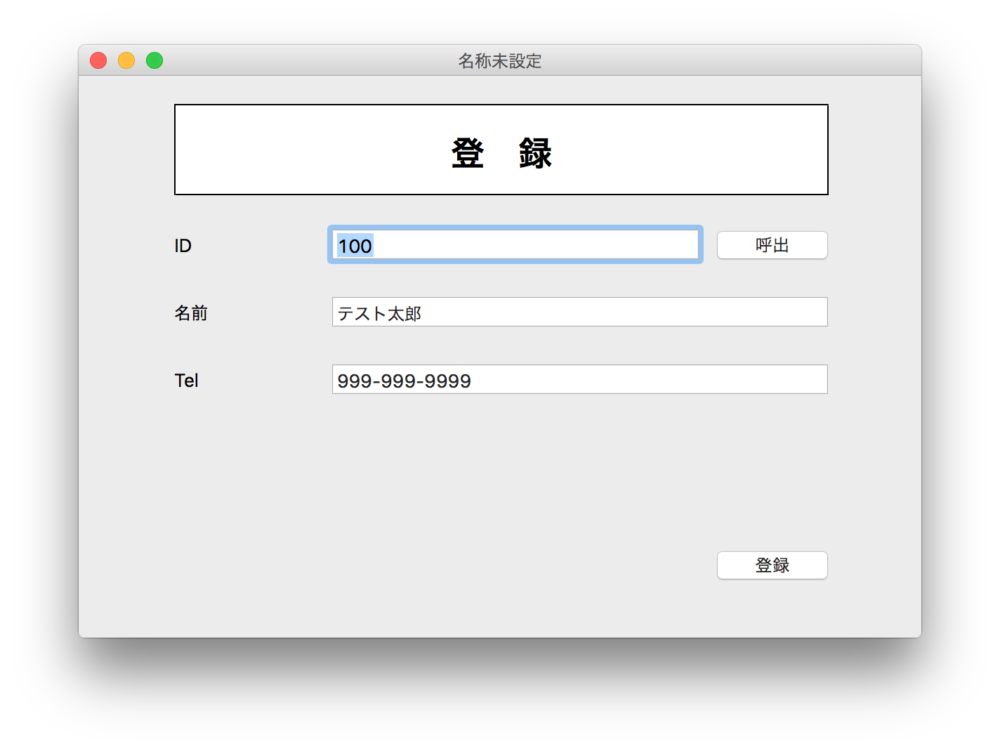

# データを読み込む

今回はデータベースに保存したデータを読み込むところを作ってみます。処理は呼出ボタンを押した時の処理になります。

## btnShow.Actionの実装

まずはコメントで紹介します。

```
  // Customerクラスを呼び出す
  
  // データを取得する

      // データ取得成功
    
    // データ取得失敗
```

## Customerクラスを呼び出す

Customerクラスのインスタンス作成は、入力されているIDを使って行います。

```
// Customerクラスを呼び出す
Dim customer as new Customer(Val(self.txtId.text ))
```

## データを取得する

データの取得は Customer.showData を使います（実装は後述）。この返却値によって、取得成功と失敗を判定します。

```
// データを取得する
if customer.showData then
  // データ取得成功
else
  // データ取得失敗
end
```

## データ取得成功

データの取得が成功した時にはクラスのプロパティに各値が入っているので、それを画面上に表示します。

```
    // データ取得成功
    Self.txtId.Text = customer.id.ToText
    Self.txtName.Text = customer.name
    Self.txtTel.Text = customer.tel
```

## データ取得失敗

データ取得に失敗した場合はアラートを出します。

```
    // データ取得失敗
    MsgBox "データが読み込めませんでした"
```

## btnShow.Actionの内容

全体の内容は次のようになります。

```
  // Customerクラスを呼び出す
  Dim customer as new Customer(Val(self.txtId.text ))
  
  // データを取得する
  if customer.showData then
    // データ取得成功
    Self.txtId.Text = customer.id.ToText
    Self.txtName.Text = customer.name
    Self.txtTel.Text = customer.tel
  Else
    // データ取得失敗
    MsgBox "データが読み込めませんでした"
  end
  ```

### Customer.showDataの実装

では続いて `Customer.showData` を実装します。

```
  // SQLの定義
  
  // レコードセットの用意&SQL実行
  
  // SQLエラーの確認
  
  // データの存在確認
  
    // データがあればプロパティにセット
    
    // データがなければエラー
  
  // 完了
```

### SQLの定義

SQLは次のようになります。 `customers` テーブルから idを使って1件取得するだけです。

```
  // SQLの定義
  Dim sql As String
  sql = "SELECT * FROM customers WHERE id = '" + _
                      self.id.ToText + "' limit 1"
```

### レコードセットの用意&SQL実行

次にデータを検索するために `RecordSet` を使います。そして、SQLを実行します。

```
  // レコードセットの用意
  Dim data As RecordSet
  data = App.DB.SQLSelect(sql)
```
  
### SQLエラーの確認

SQL実行後はエラーを確認します。

```
  // SQLエラーの確認
  If App.DB.Error Then
    System.DebugLog(App.DB.ErrorMessage)
    return false
  End If
```
  
### データの存在確認

データの存在確認は次のように行います。

```
If data <> Nil and data.EOF = false Then
```

EOFがTrueであれば最終行という意味になります。

### データがあればプロパティにセット

カスタマークラス（自分自身）のプロパティに値をセットします。

```
    // データがあればプロパティにセット
    self.name = data.Field("name")
    self.tel      = data.Field("tel")
```
    
データがない場合はFalseを返します。処理が完了すればTrueを返します。

### Customer.showDataの内容

Customer.showDataは次のようになります。

```
  // SQLの定義
  Dim sql As String
  sql = "SELECT * FROM customers WHERE id = '" + _
                      self.id.ToText + "' limit 1"
  
  // レコードセットの用意
  Dim data As RecordSet
  data = App.DB.SQLSelect(sql)
  
  // SQLエラーの確認
  If App.DB.Error Then
    System.DebugLog(App.DB.ErrorMessage)
    return false
  End If
  
  // データの存在確認
  If data <> Nil and data.EOF = false Then
    // データがあればプロパティにセット
    self.name = data.Field("name")
    self.tel      = data.Field("tel")
  else
    // データがなければエラー
    return false
  End
  
  // 完了
  return true
```

## 試してみる

ではアプリケーションを実行して動作を確認してみましょう。すでに保存されているIDを入力して呼出ボタンを押すと、データがあれば名前とTelが表示されるはずです。

呼出ボタンを押す前。



呼出ボタンを押した後。



----

これでデータベースを使ったデータの読込、登録処理を行うアプリケーションが開発できました。

今回のハンズオンは以上になります。Xojoを使えばデータベースアプリケーションがとても簡単に作成できます。ぜひ使ってみてください。
