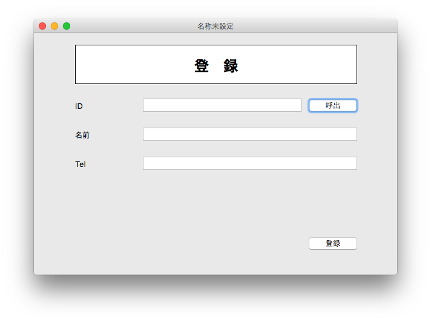
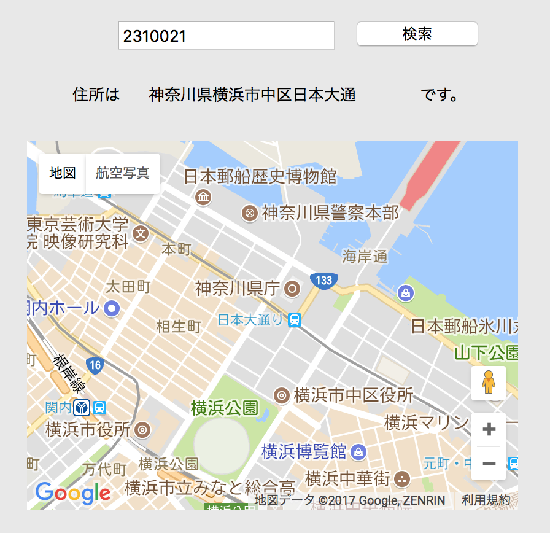

# Xojoハンズオン資料

このハンズオンではXojoを使い、DBアプリケーションを開発します。スクリーンショットはMac OSXですが、Windowsでも変わらず開発できます。

## ハンズオンの内容

今回のハンズオンでは、まず次のような画面のアプリケーションを開発します。

機能は以下の2つです。

1. IDを入力して呼出ボタンを押すと、SQLite3から該当データを呼び出します
2. 登録ボタンを押すとSQLite3に入力内容を保存します。

### Web APIを使ったアプリケーション開発

データベースアプリケーションが作り終わった方向けにWeb APIを使ったWebアプリケーションの作り方も紹介します。こちらもぜひトライしてください。

## Xojoのダウンロード&インストール

Xojoは[ダウンロード | Xojo｜グレープシティ株式会社](https://xojo.grapecity.com/download)よりダウンロード&インストールを行ってください。

## ハンズオンの内容

目次は次のようになっています。

1. [プロジェクトを作る](1.md)
2. [画面を作る](2.md)
3. [実行してみる&開発の準備](3.md)
4. [イベントを実装する](4.md)
5. [デバッグする](5.md)
6. [クラスの作成](6.md)
7. [データベースに接続する](7.md)
8. [データを保存する](8.md)
9. [データを読み込む](9.md)
10. [Web APIを試す](10.md)
11. [ネットワークデータの取得処理を作る](11.md)
12. [地図を表示する](12.md)

ではまず[プロジェクトを作る](1.md)からはじめてください。
